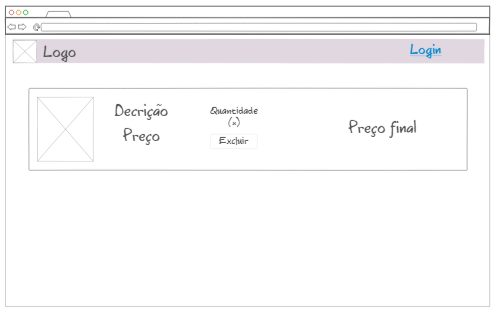

# eng-soft-2022-2
RF10 - Excluir item do carrinho

- Atores:
Usuário - Exclui item;
- Descrição sucinta:
Excluir um item que o autor não tem mais interesse do carrinho de compras.
- Pré condição:
O ator precisa estar logado na conta pessoal do mesmo e o carrinho de compras não pode estar vazio.
- Fluxo principal:
	1- O ator precisa fazer login na própria conta para automaticamente ser enviado para tela inicial do sistema;
	2- No canto superior direito o ator vai encontrar um ícone de carrinho que ao selecioná-lo o ator é enviado para a tela do carrinho;
	3- O autor deve então localizar o item que deseja excluir;
	4- O ator deve então selecionar o ícone de lixeira que vai estar localizado em um espaço abaixo da quantidade;
	5- Após o ator efetuar todos os procedimentos, ele deve confirmar a exclusão do produto do carrinho clicando no botão “Sim”;
	6- Logo o sistema irá retornar para a página do carrinho porém agora atualizado e mostrando os itens existentes no carrinho antes de efetuar a exclusão, porém sem o item excluído;
- Campos do formulário:

|Campo|Obrigatório?|Editável?|Formato|
|---|---|---|---|
|||||

- Opções do ator:

|Opção|Descrição|Atalho|
|---|---|---|
|Excluir|Exclui o item do carrinho||
|Confirmar exclusão|Confirmação antes de excluir o item||

- Fluxos alternativos:   
FA01 - Se o carrinho estiver vazio   
	1- O sistema exibirá uma mensagem avisando que o carrinho está vazio;   
FA02 - O ator não está logado   
	1- O sistema exibirá a tela do carrinho, porém sem itens. No canto superior esquerdo o sistema exibirá um botão de “Login” onde ao selecioná-lo o autor será redirecionado para página de login do sistema;  

- User story  

Eu como ator, gostaria de excluir um item que eu não desejo mais do meu carrinho, para assim poder obter apenas os item que eu desejo e gostaria de comprar;   

- Protótipo  

